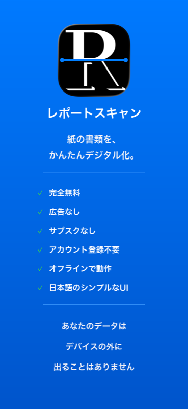
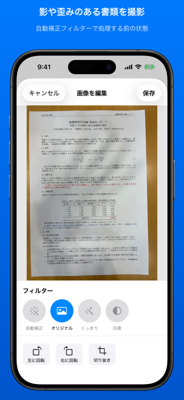
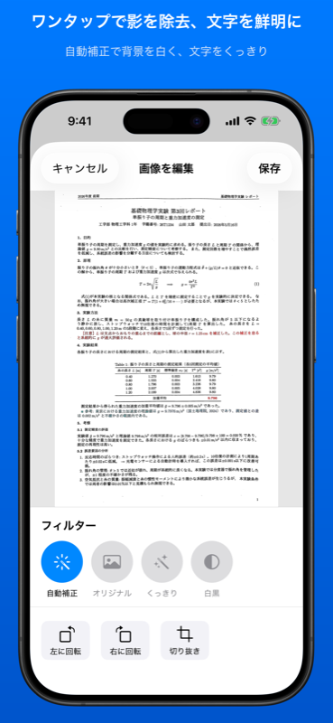
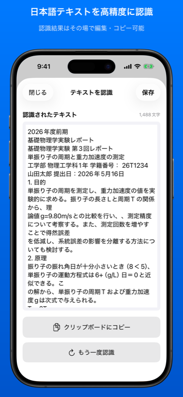
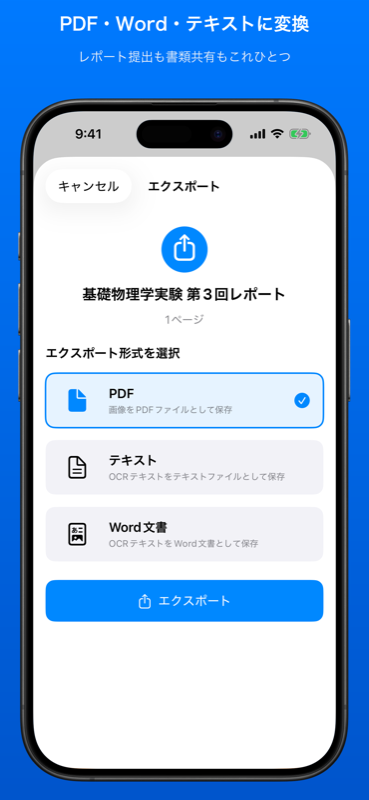

# ReportScan（レポートスキャン）

📄 iOSドキュメントスキャナーアプリ


[](https://apps.apple.com/jp/app/id6758909865)

[**📲 App Storeで公開中**](https://apps.apple.com/jp/app/id6758909865) — 完全無料・広告なし・サブスクなし

[English README is here](README.en.md) | 画像処理パラメータのチューニングに使用したCLIツール → [report-scan-filter-tuner](https://github.com/k-haruya/report-scan-filter-tuner)

## スクリーンショット

| | 影除去前 | 影除去後 | OCR | エクスポート |
|---|---|---|---|---|
|  |  |  |  |  |

## 技術ハイライト

本リポジトリのREADME後半には、開発中に直面した問題と解決の全記録(開発ログ)を残しています。主なポイント:

- **独自の影除去アルゴリズム**: Division Normalization(背景除算)+ 適応的二値化をCore Image + **Metal CI Kernel**で実装。パラメータは自作CLIツール([report-scan-filter-tuner](https://github.com/k-haruya/report-scan-filter-tuner))で系統的にスイープして決定
- **メモリ最適化**: SwiftDataの`@Attribute(.externalStorage)`、`autoreleasepool`によるバッチ処理のピーク制御、`CGImageSourceCreateThumbnailAtIndex`によるダウンサンプリングでOOMクラッシュを解消
- **UIレスポンス**: 画像回転をView State + 保存時EXIF適用に分離して0ms遅延を実現。UIKit `UIScrollView`をSwiftUIに統合しズーム/パン/スクロールのジェスチャー競合を解決
- **Swift Concurrency**: MainActor分離・`Task.detached`・`nonisolated`の使い分けを実践(開発ログ#11参照)
- **完全オンデバイス処理**: OCR(Vision)・画像処理ともに外部送信なしのプライバシー設計

## 概要

ReportScanは、紙のドキュメントをデジタル化するためのiOSアプリです。カメラまたはフォトライブラリから画像を取得し、自動補正・OCR（文字認識）・PDF/Word/テキストへのエクスポートが可能です。

## 主な機能

### 📸 スキャン機能
- **カメラ撮影**: 複数ページの連続撮影に対応
- **フォトライブラリ**: 既存の画像を複数選択してインポート

### 🎨 画像編集
- **自動補正**: 台形補正 + 影除去 + 文字強調を自動適用
- **くっきり**: コントラスト強調でメリハリのある画像に
- **白黒**: モノクロ変換
- **オリジナル**: 補正なしの元画像
- **回転**: 90度単位で左右回転
- **ページ削除**: 不要なページを削除

### 📝 OCR（文字認識）
- **対応言語**: 日本語、英語、日本語+英語
- **並列処理**: 複数ページを同時に処理
- **自動保存**: 認識結果をドキュメントに自動保存
- **編集可能**: 認識結果をその場で編集

### 📤 エクスポート
| 形式 | 説明 |
|------|------|
| **PDF** | 画像をPDFとして保存 |
| **TXT** | OCRテキストをテキストファイルとして保存 |
| **DOCX** | OCRテキストをWord文書として保存 |

### 📁 フォルダ管理
- フォルダを作成してドキュメントを整理
- ドキュメントの名前変更・削除
- スワイプ操作と長押しメニュー対応

---

## 技術仕様

### 対応環境
- **iOS**: 17.0以上
- **Xcode**: 15.0以上
- **Swift**: 5.9以上

### 使用フレームワーク
| フレームワーク | 用途 |
|--------------|------|
| SwiftUI | UI構築 |
| SwiftData | データ永続化 |
| Vision | OCR・四角形検出 |
| CoreImage | 画像フィルター処理 |
| PDFKit | PDF生成 |
| ZIPFoundation | DOCX生成 |

### 依存ライブラリ
```swift
// Package.swift
.package(url: "https://github.com/weichsel/ZIPFoundation.git", from: "0.9.0")
```

---

## プロジェクト構成

```
ReportScan/
├── ReportScan/
│   └── ReportScanApp.swift          # アプリエントリーポイント
├── Models/
│   ├── ScannedDocument.swift        # ドキュメントモデル
│   └── DocumentFolder.swift         # フォルダモデル
├── Views/
│   ├── Home/
│   │   ├── HomeView.swift           # メイン画面
│   │   ├── FolderListView.swift     # フォルダ一覧
│   │   ├── DocumentListView.swift   # ドキュメント一覧
│   │   └── DocumentRowView.swift    # ドキュメント行
│   ├── Edit/
│   │   ├── ImageEditorView.swift    # 画像編集画面
│   │   ├── FilterPreviewView.swift  # フィルタープレビュー
│   │   └── OCRResultView.swift      # OCR結果画面
│   ├── Export/
│   │   └── ExportView.swift         # エクスポート画面
│   ├── Scan/
│   │   ├── DocumentScannerView.swift # カメラスキャナー
│   │   └── PhotoPickerView.swift    # フォトピッカー
│   └── Settings/
│       └── SettingsView.swift       # 設定画面
├── ViewModels/
│   └── HomeViewModel.swift          # ホーム画面ロジック
├── Services/
│   ├── ImageFilterService.swift     # 画像フィルター処理
│   ├── FilterConfig.swift           # フィルターパラメータ
│   ├── OCRService.swift             # OCR処理
│   ├── PDFExportService.swift       # PDF生成
│   ├── TXTExportService.swift       # TXT生成
│   └── WordExportService.swift      # DOCX生成
├── Utilities/
│   ├── Constants.swift              # 定数
│   ├── AppStrings.swift             # UI文字列
│   └── ColorTheme.swift             # カラーテーマ
└── Resources/
    ├── Localizable.strings          # ローカライズ
    └── ja.lproj/
        └── InfoPlist.strings        # 権限説明文
```

---

## データモデル

### ScannedDocument
```swift
@Model
final class ScannedDocument {
    var id: UUID
    var title: String
    var createdAt: Date
    var updatedAt: Date
    var ocrText: String?
    var imageData: [Data]           // オリジナル画像
    var processedImageData: [Data]? // フィルター適用済み画像
    var filterTypes: [String]       // 各ページのフィルター
    var folder: DocumentFolder?     // 所属フォルダ
}
```

### DocumentFolder
```swift
@Model
final class DocumentFolder {
    var id: UUID
    var name: String
    var createdAt: Date
    var updatedAt: Date
    var documents: [ScannedDocument] // カスケード削除
}
```

---

## 設定項目

| 項目 | キー | デフォルト値 |
|------|------|-------------|
| 画像品質 | `imageQuality` | 0.8 (80%) |
| OCR言語 | `ocrLanguage` | `ja-JP` |
| OCR自動保存 | `autoSaveOCR` | `true` |

---

## フィルターパラメータ

フィルターの調整は `FilterConfig.swift` で一元管理しています：

```swift
struct FilterConfig {
    struct EdgeEnhance {
        static let radius: Float = 3.0
        static let intensity: Float = 0.8
    }
    struct ToneCurve {
        static let point0 = CGPoint(x: 0.0, y: 0.15)
        // ...
    }
}
```

---

## ビルド方法

1. リポジトリをクローン
2. Xcodeでプロジェクトを開く
3. ZIPFoundationパッケージが自動解決されるのを待つ
4. iOSシミュレータまたは実機を選択
5. ⌘+R でビルド＆実行

---

## ライセンス

Private - All rights reserved

---

## 開発ログ・技術的最適化の記録 (2026/02/07)

### 1. メモリ使用量の劇的改善 (SwiftData / Large Binary Data)
*   **課題**: `ScannedDocument` モデルが多数の画像データ（`Data`型）を保持しており、フォルダ一覧を開いた瞬間にすべての画像データがメモリに展開され、メモリ不足（OOM）でクラッシュしていた。
*   **解決策**: SwiftDataの `@Attribute(.externalStorage)` を `imageData` と `processedImageData` に適用。
    *   これにより、画像バイナリはデータベース外部のファイルとして保存され、プロパティにアクセスした瞬間だけロードされる（Lazy Loading）挙動になった。
*   **結果**: 数十枚の画像を含むドキュメントがあっても、リスト表示時のメモリ消費が最小限に抑えられ、クラッシュが完全に解消。

### 2. パフォーマンス最適化：永続化戦略への転換
*   **課題**: 当初は「閲覧時・エクスポート時にリアルタイムでフィルターを適用する」設計だったが、CPU負荷が高く、PDF生成やスムーズな閲覧に支障が出ていた。
*   **解決策**: 「編集完了時に処理結果を保存する（永続化）」戦略に変更。
    *   編集画面で保存ボタンを押したタイミングでフィルター処理を実行し、`processedImageData` として保存。
    *   閲覧・一覧表示・PDF生成時は、すでに処理された画像を読み込むだけにすることで、**CPU負荷ほぼゼロ＆爆速表示**を実現。
    *   オリジナル画像（`imageData`）も保持し続けることで、いつでも「オリジナルに戻す（非破壊編集）」ことが可能。
    *   ストレージ容量は増加するが、ユーザー体験（閲覧スピード）を最優先した。

### 3. UI/UXの向上
*   **ローディング表示 (`LoadingOverlay`)**:
    *   画像保存やPDF生成など、数秒かかる処理の実行中に「画像を保存中...」等のインジケータを表示し、ユーザーに処理中であることを明示。
*   **ページの並び替え機能**:
    *   編集画面に `ReorderImagesView` を実装。ドラッグ＆ドロップで直感的にページの順序を入れ替え可能にし、完了時に画像・フィルター設定・処理済み画像の整合性を保って保存するようにした。
*   **サムネイルの高速化と省メモリ化**:
    *   一覧画面では `CGImageSourceCreateThumbnailAtIndex` を使用し、大きな画像をデコードせずにサムネイルサイズ（最大120px）で読み込むダウンサンプリングを実装。

### 4. 画像処理のメモリ最適化 (Alpha Channel)
*   **課題**: 保存される画像にアルファチャンネルが含まれており、メモリ消費が倍増する警告（`AlphaPremulLast`）が出ていた。
*   **解決策**: `UIGraphicsImageRenderer` のフォーマットを `.opaque = true` に設定し、強制的にアルファチャンネルを削除してJPEG保存するように修正。不要なメモリ使用を削減。

### 5. 画像処理アルゴリズムの刷新 (Division Normalization)
*   **課題**: 従来の単純なフィルタリングでは、照明ムラや強い影があるドキュメントの文字視認性を確保できなかった。
*   **解決策**: **Division Normalization (背景除算)** アルゴリズムを実装。
    1.  元画像を強力にぼかして「背景（影や照明ムラ）」を推定。
    2.  元画像を背景画像で除算（正規化）することで、照明ムラをキャンセルし、文字情報だけを抽出。
    3.  適応的二値化と組み合わることで、スキャン専用機並みのクリアな画質を実現。

### 6. ナビゲーション体験の改善
*   **課題**: フォルダやドキュメントを開く際、データのロードやビュー構築により、タップしてから遷移するまでにフリーズしたようなラグが発生していた。
*   **解決策**:
    *   遷移処理を意図的に0.1秒遅延させ、その間に即座に「読み込み中...」のアニメーションを表示。
    *   UIスレッドをブロックせずに処理中であることをユーザーにフィードバックすることで、体感的な待ち時間を解消。

### 7. アプリアイコンの設定
*   **更新**: `Assets.xcassets` を構成し、オリジナルのアプリアイコン (`Icon-Light-1024x1024.png`) を適用。

---

## 開発ログ・第2フェーズ: コード品質改善 & UI/UX改修 (2026/02/08)

### 8. 画像回転機能の試行錯誤（3つのアプローチ）

画像の90度回転を実装する際、3つの異なるアプローチを試行錯誤した。

#### アプローチ1: CGContextによるピクセル回転（不採用）
```swift
// CGContextで新しいキャンバスにピクセルを回転描画
let context = CGContext(data: nil, width: newHeight, height: newWidth, ...)
context?.rotate(by: .pi / 2)
context?.draw(cgImage, in: rect)
```
- **問題**: 高解像度画像（4000x3000px等）の場合、回転処理に数百ms〜数秒かかり、UIが固まる。ユーザーが回転ボタンを連打すると深刻なラグが発生。
- **学び**: ピクセル操作を伴うリアルタイム回転は、モバイルでは実用的でない。

#### アプローチ2: EXIF Orientationメタデータ変更（部分採用）
```swift
// JPEGデータのEXIFメタデータだけを書き換え（ピクセルデータには触らない）
CGImageDestinationAddImageFromSource(destination, source, 0,
    [kCGImagePropertyOrientation: newOrientation])
```
- **利点**: ピクセルデータのデコード/エンコードが不要で超高速（<1ms）。
- **問題**: 即座にUIに反映するためにはJPEGデータを再読み込みする必要があり、体感的に遅延が発生。

#### アプローチ3: SwiftUI View Stateで即時回転 + 保存時にEXIF適用（最終採用）
```swift
// 表示: SwiftUIの.rotationEffectで即座に回転（ピクセル操作なし）
.rotationEffect(.degrees(Double(rotationSteps) * 90.0))
.scaleEffect(rotationScale)

// 保存時: EXIFメタデータ変更で非破壊的に回転を確定
for _ in 0..<(steps % 4) {
    data = rotateJPEGByExif(data, clockwise: true)
}
```
- **結果**: ユーザーは回転ボタンを押した瞬間に結果を確認でき（0ms遅延）、保存時のみEXIF変更で高速に確定。UIとデータ処理の完全な分離を実現。
- **回転スケール計算**: 90度回転時に画像がはみ出さないよう、アスペクト比に基づいたスケール調整を追加。
```swift
let rotationScale = isOddRotation ? min(1.0, 1.0 / imageAspect) : 1.0
```

---

### 9. パフォーマンス最適化（5項目の一括改善）

実機テストで発見されたパフォーマンス問題を5項目同時に修正した。

#### 9-1. @Queryの最適化
- **問題**: `DocumentDetailView` が `@Query private var documents: [ScannedDocument]` で全ドキュメントを取得していた。
- **解決**: `#Predicate` で対象ドキュメントのみフィルタリング。
```swift
_documents = Query(filter: #Predicate<ScannedDocument> { doc in
    doc.id == id
})
```

#### 9-2. サムネイルの非同期生成 + メモリキャッシュ
- **問題**: ドキュメント一覧のスクロール時、各行のサムネイルがメインスレッドで同期生成されていた。
- **解決**: `ThumbnailCache`（NSCache, 100枚上限）を導入。`.task(id:)` で非同期生成、`Task.detached(priority: .utility)` でバックグラウンド処理。
```swift
.task(id: cacheKey) { await loadThumbnail() }
// → Task.detached で CGImageSourceCreateThumbnailAtIndex (120px)
// → NSCache に保存（スクロール時の再生成を防止）
```
- **学び**: `nonisolated` キーワードを `static func` に付与することで、`Task.detached` からの呼び出しが可能になった。ただしMainActor依存がある場合は使用不可。

#### 9-3. 詳細画面の画像ダウンサンプリング
- **問題**: `DocumentDetailView` でフル解像度画像をデコードしていた（12MPの画像で50MB以上のメモリ消費）。
- **解決**: `CGImageSourceCreateThumbnailAtIndex` で画面幅に合わせたサイズでデコード。
```swift
let maxPixelSize = UIScreen.main.bounds.width * UIScreen.main.scale
// → フル解像度の1/3〜1/4のメモリで表示
```

#### 9-4. バッチフィルター処理のメモリピーク軽減
- **問題**: 複数ページのフィルター保存時、すべてのUIImage/CIImageが同時にメモリに残り、ピーク使用量が数百MBに達していた。
- **解決**: `autoreleasepool` で各ページの処理ごとに中間オブジェクトを解放。
```swift
for (index, imageData) in rotatedImageDataArray.enumerated() {
    let resultData: Data? = autoreleasepool {
        guard let image = UIImage(data: imageData) else { return nil }
        let filtered = ImageFilterService.shared.applyFilter(filterType, to: image)
        return filtered?.jpegData(compressionQuality: capturedQuality)
    } // ← ここで image, filtered が即座に解放される
}
```

#### 9-5. ナビゲーション遅延の削除
- **問題**: 以前は遷移時に0.1秒の人工的な遅延 + LoadingOverlay を表示していたが、上記の最適化により不要になった。
- **解決**: `isNavigating` フラグと `DispatchQueue.main.asyncAfter` を削除し、即座に遷移するように変更。

---

### 10. 包括的コードレビュー（29問題発見 → 14件修正）

コードベース全体をレビューし、以下のカテゴリで29件の問題を発見。うち14件を修正した。

#### Critical（クラッシュの可能性）

**10-1. OCRService: `withCheckedThrowingContinuation` の二重resume防止**
- **問題**: `VNImageRequestHandler.perform()` がcompletionハンドラを呼びつつ例外も投げるケースで、`continuation.resume` が2回呼ばれてクラッシュする可能性があった。
- **解決**: `var hasResumed = false` フラグで二重呼び出しをガード。
```swift
try await withCheckedThrowingContinuation { continuation in
    var hasResumed = false
    let request = VNRecognizeTextRequest { request, error in
        guard !hasResumed else { return }
        hasResumed = true
        continuation.resume(/* ... */)
    }
    do { try handler.perform([request]) }
    catch {
        guard !hasResumed else { return }
        hasResumed = true
        continuation.resume(throwing: error)
    }
}
```

**10-2. ExportView: PDFが未処理画像を使用していた**
- **問題**: PDF生成時に `processedImageData` を直接参照していたが、インデックス管理が不整合で未処理のオリジナル画像が出力されていた。
- **解決**: `document.getDisplayImage(at: index)` を使用し、処理済み画像があればそちらを、なければオリジナルを適切に返すようにした。

**10-3. ExportView: OCR言語設定キーの不一致**
- **問題**: SettingsViewでは `"ocrLanguage"` キーで言語設定を保存しているが、ExportViewでは存在しない `"ocrJapaneseEnabled"` / `"ocrEnglishEnabled"` キーを参照していた。OCR自動実行が常にデフォルト言語（日本語のみ）で動作していた。
- **解決**: `@AppStorage("ocrLanguage")` に統一。

#### High（データ不整合・機能不全）

**10-4. ScannedDocument: filterTypes配列の範囲外アクセス**
- **問題**: `resetProcessedImage(at:)` で `filterTypes[index]` のインデックスチェックがなかった。
- **解決**: `if index < filterTypes.count` のガードを追加。

**10-5. ImageEditorView: deleteCurrentImage のエラーハンドリング欠如**
- **問題**: `try? modelContext.save()` で保存エラーが黙殺されていた。
- **解決**: `do/try/catch` に変更し、エラーアラートを表示。

**10-6. ReorderImagesView: saveOrder のエラーハンドリング欠如**
- **同様の修正**: 保存失敗時にエラーアラートを表示するように変更。

#### Medium（コード品質）

- ExportViewに `import SwiftData` と `@Environment(\.modelContext)` を追加
- ExportViewの一時ファイル名にUUIDを追加（衝突防止）
- DocumentListViewの未使用 `addButton` プロパティを削除
- HomeViewの未使用 `Array.subscript(safe:)` 拡張を削除
- WordExportServiceの未使用 `archiveCreationFailed` ケースを削除
- HomeViewの `onChange(of: document.imageData.count)` の強制アンラップ修正

---

### 11. ビルドエラー対応で得た重要な教訓

修正後に2ラウンドのビルドエラーが発生し、それぞれから重要な教訓を得た。

#### 教訓1: MainActor分離とTask.detached
```
Error: Main actor-isolated static property 'shared'
       cannot be referenced from a nonisolated context
```
- **状況**: `ImageFilterService.shared.applyFilter()` をバックグラウンドで実行するため `Task.detached` を使用しようとした。
- **原因**: `ImageFilterService` がMainActorに分離されているため、`Task.detached`（MainActorコンテキストを継承しない）からは呼び出せない。
- **解決**: `Task.detached` を通常の `Task` に戻した。通常の `Task` はMainActorコンテキストを継承するため呼び出し可能。
- **教訓**: **MainActor分離されたシングルトンのメソッドは、`Task.detached` から呼び出せない**。パフォーマンスのためにバックグラウンド化したい場合は、サービス自体の分離属性を変更する必要がある。

#### 教訓2: Xcodeビルドターゲットのメンバーシップ
```
Error: Cannot find 'LoadingOverlay' in scope
```
- **状況**: `Components/LoadingOverlay.swift` にコンポーネントを分離したが、ファイルがXcodeビルドターゲットに含まれていなかった。
- **原因**: ファイルシステム上にファイルが存在しても、`.xcodeproj` のビルドターゲットに追加されていなければコンパイルされない。
- **解決**: `HomeView.swift` 末尾に `LoadingOverlay` を定義し直し、ターゲット外のファイルを削除。
- **教訓**: **新しいSwiftファイルを追加する際は、必ずXcodeのビルドターゲットメンバーシップを確認する**。CLIやファイルマネージャからファイルを追加しただけでは不十分。

#### 教訓3: nonisolatedキーワードの適用条件
- `nonisolated` は、**MainActor依存がないstatic関数**にのみ安全に適用可能。
- `ThumbnailView.createThumbnail()` → 値型（Data, Int）のみ使用 → `nonisolated` OK
- `ImageEditorView.rotateJPEGByExif()` → `ImageFilterService.shared` を使用 → `nonisolated` NG

---

### 12. カメラUI改修の試行錯誤（完了ボタン問題）

#### 問題の発見
2枚目以降のカメラ撮影時、iOS標準の「写真を使用/撮り直し」プレビュー画面にカスタム「完了」ボタンが重なって表示される問題を発見。プレビュー中に「完了」を押すと、プレビュー中の写真が `capturedImages` に追加される前に撮影が終了し、その写真が消失していた。

#### アプローチ1: 完了ボタンの完全削除（不採用）
- **実装**: `doneButton` を完全に削除し、キャンセルボタン（既に「撮影済み画像がある場合は保存」するロジックを持つ）のみに依存。
- **問題**: ユーザーから「完了ボタンがないと終了方法がわからずUIが悪い」とフィードバック。
- **教訓**: 機能の削除は慎重に。問題のある機能でも、代替手段がユーザーに明確でなければUXが悪化する。

#### アプローチ2: showsCameraControls = false でカスタムUI（最終採用）
- **発想の転換**: iOS標準のプレビュー画面自体を排除すれば、完了ボタンが不適切な場面で表示される問題が根本解消される。
- **実装**: `UIImagePickerController.showsCameraControls = false` で標準コントロールを非表示にし、完全カスタムのカメラUIを構築。

```
カメラUI構成:
┌─────────────────────────────┐
│ [閉じる]      [N枚撮影済み] │  ← 上部
│                             │
│      (カメラプレビュー)       │  ← 中央（4:3→フルスクリーンに拡大）
│                             │
│         [⊙]        [完了]   │  ← 下部（シャッター + 完了）
└─────────────────────────────┘
```

- **カメラプレビューのフルスクリーン化**:
```swift
let previewHeight = screenBounds.width * (4.0 / 3.0)
if previewHeight < screenBounds.height {
    let scale = screenBounds.height / previewHeight
    picker.cameraViewTransform = CGAffineTransform(scaleX: scale, y: scale)
}
```

- **撮影フロー**: `takePicture()` → `didFinishPickingMediaWithInfo` で画像保存 → dismiss → 即座にカメラ再表示。プレビュー画面なしで連続撮影が可能。
- **完了ボタン**: 1枚以上撮影後にのみ表示。撮影中（プレビューなし）に常時表示されるため、問題が完全に解消。
- **撮影フィードバック**: 標準のプレビューがなくなったため、シャッター押下時にフラッシュエフェクト（白い画面の一瞬の点滅）を追加。

---

### 13. 画像エディターのピンチズーム実装

#### 問題
画像を90度回転した後、`ScrollView` のスクロール方向が元の画像の向きに固定されたままになり、回転後の画像全体を確認できなくなっていた。

#### 解決策: ScrollViewをジェスチャーベースのズームコンテナに置換
```swift
// Before: ScrollViewで画像を表示（回転との相性が悪い）
ScrollView([.horizontal, .vertical]) {
    FilterPreviewView(image: image, filterType: selectedFilterType)
        .rotationEffect(...)
}

// After: GeometryReader + ZStack + ジェスチャー
GeometryReader { geometry in
    ZStack {
        FilterPreviewView(image: image, filterType: selectedFilterType)
            .rotationEffect(.degrees(rotationDegrees))
            .scaleEffect(rotationScale * zoomScale)  // 回転スケール × ズームスケール
            .offset(dragOffset)
            .gesture(MagnificationGesture())      // ピンチズーム (1.0x 〜 5.0x)
            .simultaneousGesture(DragGesture())   // ズーム時のパン
            .onTapGesture(count: 2) { resetZoom() } // ダブルタップリセット
    }
    .frame(width: geometry.size.width, height: geometry.size.height)
    .clipped()  // はみ出し防止
}
```

- **ポイント**: 回転時にもズーム時にも `resetZoom()` を呼び出し、状態をクリーンに保つ。

---

### 14. ドキュメント詳細画面のレイアウト改修（2段階）

#### 問題
画像もアクションボタンも同一の `ScrollView` 内にあり、画像サイズによってボタンの位置が大きく変動していた（縦長画像ではボタンが画面外に、横長画像ではスカスカの空白が生まれる）。

#### 第1段階: VStack分割（部分採用後に改修）
```swift
// 上部: 画像（固定エリア、残りスペースを使用）
// 下部: ボタン（ScrollView、固定位置）
VStack(spacing: 0) {
    ZStack { /* 画像 + ピンチズーム */ }  // 残りスペースを使用
    ScrollView { /* ボタン群 */ }          // 固定高さ
}
```
- **効果**: ボタン位置が画像サイズに依存しなくなった。
- **問題**: ユーザーから「画像エリアが固定されてスクロールできないのはUIが悪い。画像もボタンも一緒にスクロールできた方がいい」とフィードバック。

#### 第2段階: ScrollView + 固定高さ画像エリア（最終採用）
```swift
ScrollView {
    VStack(spacing: 12) {
        ZStack { /* 画像 + ピンチズーム */ }
            .frame(height: UIScreen.main.bounds.height * 0.45)  // 固定高さ
            .clipped()

        // ページネーション
        // 情報セクション
        // アクションボタン
    }
    .padding()
}
.scrollDisabled(zoomScale > 1.0)  // ズーム中はスクロール無効化
```

- **ポイント**:
  - 画像エリアは画面高さの45%で固定（画像サイズに依存しない一貫した高さ）
  - ページ全体がスクロール可能（従来のUXを維持）
  - `.scrollDisabled(zoomScale > 1.0)`: ピンチズームで拡大中はScrollViewのスクロールを無効化し、`DragGesture` によるパン操作を優先。ズーム解除（ダブルタップ）するとスクロールが復帰。
  - iOS 16+の `.scrollDisabled()` を活用（ターゲットiOS 17+なので問題なし）

---

### 設計判断のまとめ

| 判断ポイント | 選択肢 | 採用理由 |
|-------------|--------|---------|
| 画像回転 | View State回転 + 保存時EXIF | UIレスポンス最優先（0ms遅延） |
| フィルター処理の並行化 | Task（MainActor継承） | ImageFilterServiceがMainActor分離のため |
| メモリ最適化 | autoreleasepool + downsampling | OOMクラッシュ防止、体感速度向上 |
| カメラUI | showsCameraControls = false | プレビュー画面問題の根本解消 |
| 詳細画面レイアウト | ScrollView + 固定高さ画像 | 一貫した画像サイズ + スクロール可能なUX |
| ズーム中のスクロール制御 | .scrollDisabled(zoomScale > 1.0) | ジェスチャー競合の回避 |

---

### 15. ズーム時のパン操作とScrollViewの共存問題（3段階の進化）

#### 問題
ドキュメント詳細画面でピンチズームした状態だと、ズーム中の画像内パン（移動）と、ページ全体のScrollViewスクロールが競合していた。

#### 段階1: `.scrollDisabled(zoomScale > 1.0)` で切り替え（不採用）
- ズーム時はScrollViewを無効化し、ドラッグでパン操作。
- **問題**: わずかでもズームするとスクロールが完全に無効化され、下のボタンに到達できない。

#### 段階2: DragGesture削除、MagnificationGestureのみ（中間解）
- パン操作を諦め、ピンチズーム + ダブルタップリセットのみに。
- **問題**: ズーム後に画像の別の場所を見ることができない。

#### 段階3: UIKit UIScrollView（最終採用）
```swift
class ZoomableScrollView: UIScrollView, UIScrollViewDelegate {
    // isScrollEnabled = false (等倍時) → 親ScrollViewにジェスチャーを譲る
    // isScrollEnabled = true  (拡大時) → UIScrollViewがパンを消費
    func scrollViewDidZoom(_ scrollView: UIScrollView) {
        isScrollEnabled = zoomScale > 1.01
    }
}
```
- **結果**: UIScrollViewのネイティブなジェスチャー優先度管理により、ズーム/パン/親スクロールが自然に共存。ダブルタップで3倍ズーム or リセット。

---

### 16. ズーム時のドラッグ制限（画像エディター）

#### 問題
画像エディター（SwiftUIジェスチャーベース）で最小倍率時にも画像をドラッグでき、画像がフレーム外に移動してしまっていた。

#### 解決: clampOffset関数
```swift
private static func clampOffset(_ offset: CGSize, containerSize: CGSize, effectiveScale: CGFloat) -> CGSize {
    let maxX = max(0, containerSize.width * (effectiveScale - 1) / 2)
    let maxY = max(0, containerSize.height * (effectiveScale - 1) / 2)
    return CGSize(
        width: min(maxX, max(-maxX, offset.width)),
        height: min(maxY, max(-maxY, offset.height))
    )
}
```
- 等倍時: `maxOffset = 0` → 移動不可（iOS標準挙動）
- 拡大時: はみ出し分だけ移動可能

---

### 17. 手動切り抜き機能（台形補正）

#### 背景
自動台形補正（Vision + CIPerspectiveCorrection）がまれに失敗し、不適切な切り抜きになるケースがあった。

#### 実装: PerspectiveCorrectionView
- 4つのドラッグ可能なコーナーハンドル（28pt表示 / 56ptヒットエリア）
- 初期位置: Visionフレームワークで矩形を自動検出し、その四隅に配置
- 選択領域を青い線 + 半透明で可視化
- ピンチズーム（0.4x〜3.0x）+ パンで画像の端にもアクセス可能
- ダブルタップでズーム/オフセットリセット
- 適用時に `CIPerspectiveCorrection` で切り抜き → JPEG保存

#### ジェスチャー優先度設計
```
1本指 on ハンドル → .highPriorityGesture(DragGesture) → ハンドル移動
1本指 on 空白     → .gesture(DragGesture) → 画像全体パン
2本指ピンチ       → .simultaneousGesture(MagnificationGesture) → ズーム
ダブルタップ       → リセット
```

#### 命名の工夫
「台形補正」→「切り抜き」に変更。一般ユーザーにとって直感的な名前を選択。画面タイトルは「切り抜き範囲を選択」。

---

### 18. 切り抜き機能のメモリクラッシュ修正

#### 問題
切り抜きを2回実行するとOOM（メモリ不足）でアプリがkillされていた。

#### 原因と対策（3点）

| 原因 | 旧コード | 新コード | 削減量 |
|------|---------|---------|--------|
| `normalizedImage` computed property | `UIGraphicsImageRenderer` で毎回フル解像度コピー生成（~48MB/回×2呼出） | `CIImage.oriented()` 遅延変換（メモリ0） | ~100MB |
| `CIContext` 毎回新規作成 | 関数内で `CIContext()` | `static let ciContext` 共有 | Metal初期化コスト排除 |
| 中間オブジェクト未解放 | autoreleasepoolなし | `autoreleasepool { }` で全処理を囲む | 即座に解放 |

#### 左右反転バグも同時修正
- **原因**: `image.cgImage` はEXIF Orientationを無視した生ピクセルを返すため、表示と画素配置がズレていた。
- **修正**: `CIImage.oriented(CGImagePropertyOrientation)` で向き情報をCIFilterパイプラインに遅延適用。`VNImageRequestHandler(orientation:)` でVisionにも向き情報を伝達。

---

### 19. 画像エディター初回表示のレンダリング修正

#### 問題
画像エディターを開いた瞬間、オレンジ背景の🚫マークが一瞬表示されていた。

#### 原因
1. `FilterPreviewView` がフィルター処理中に `ProgressView()` のみを表示
2. `.drawingGroup()` がMetal テクスチャにラスタライズする際、`ProgressView` のみのフレームでシステムプレースホルダーが発生

#### 修正
1. **FilterPreviewView**: 常にオリジナル画像を表示（`filteredImage ?? image`）し、初回のみ半透明スピナーをオーバーレイ
2. **`.drawingGroup()` 削除**: パフォーマンス問題の真の原因は `normalizedImage` のフル解像度コピーだったため（#18で修正済み）、Metal ラスタライズは不要に

---

### 設計判断のまとめ（追加分）

| 判断ポイント | 選択肢 | 採用理由 |
|-------------|--------|---------|
| ズーム+スクロール共存 | UIKit UIScrollView | ネイティブジェスチャー優先度で自然に共存 |
| EXIF向き処理 | CIImage.oriented() | メモリゼロの遅延変換、UIGraphicsRenderer不要 |
| 切り抜きハンドル優先度 | .highPriorityGesture | 1本指ハンドル移動とパンの自然な分離 |
| フィルタープレビュー | 常に画像表示 + スピナーオーバーレイ | 空フレームによるレンダリング異常を回避 |

---

## 開発ログ・第3フェーズ: 画像処理パイプラインのiOS統合 & 最適化 (2026/02/08)

### 20. Metal CI Kernelへの移行（CIKLからの脱却）

#### 問題
`ImageFilterService.swift` で使用していたカスタムカーネル（Adaptive Thresholding, Division Normalization, Color Preservation）が `CIColorKernel(source:)` で記述されていた。この初期化方法はiOS 12.0で非推奨となり、Xcodeでビルド時に2件の警告が出ていた。

```
'init(source:)' was deprecated in iOS 12.0
```

#### 解決: Metal Shading Language への移行
3つのカーネル関数をMetal CI Kernelとして `ImageFilters.metal` に移植。

```metal
#include <CoreImage/CoreImage.h>
using namespace metal;
extern "C" {
    namespace coreimage {
        float4 adaptiveThreshold(sample_t pixel, sample_t blurred, sample_t original,
                                  float offset, float strength, float darkFloor) { ... }
        float4 divisionNormalize(sample_t original, sample_t background) { ... }
        float4 colorPreserve(sample_t processed, sample_t colorRef, sample_t divNormRef,
                              float satThreshold, float preservation, float boost) { ... }
    }
}
```

Swift側はMetal Libraryからの読み込みに変更:
```swift
private lazy var metalLibData: Data? = {
    guard let url = Bundle.main.url(forResource: "default", withExtension: "metallib"),
          let data = try? Data(contentsOf: url) else { return nil }
    return data
}()

private lazy var adaptiveThresholdKernel: CIColorKernel? = {
    guard let data = metalLibData else { return nil }
    return try? CIColorKernel(functionName: "adaptiveThreshold", fromMetalLibraryData: data)
}()
```

#### ビルド設定
Metal CI Kernelのコンパイルには特別なビルドフラグが必要:
```
MTL_COMPILER_FLAGS = "-fcikernel"
MTLLINKER_FLAGS = "-fcikernel"
```

#### 学んだこと
- `-cikernel` フラグは非推奨。`-fcikernel` を使う（Metal Toolchain 更新後）
- `xcodebuild -downloadComponent MetalToolchain` でMetal Toolchainをダウンロードする必要がある場合あり
- CIColorKernelは `sample_t` 型で入力画像を受け取り、3つまでの `__sample` パラメータをサポート
- `CIColorKernel(source:)` → `CIColorKernel(functionName:fromMetalLibraryData:)` への移行は1対1で可能

---

### 21. renderIntermediate座標ズレによる二重画像バグ

#### 問題
画像処理適用後、「ほんのずれた2つの画像を合わせたような結果」になる現象が発生。保存結果が二重像のようにぼやけて見えた。

#### 原因の特定
iOS版とFilterTuner（macOS CLI）のパイプラインを比較して発見。

```
FilterTuner（macOS）: CIImageチェーンを直接接続 → 座標はすべて一致 → 問題なし
iOS版: renderIntermediate()で中間レンダリング → CIImage → CGImage → CIImage
```

iOS版の `renderIntermediate()` は CIImage チェーンを確定してメモリを解放するためのメソッドだが、以下の座標ズレが発生していた:

```
Step 4: UnsharpMask
  → CIImage.extent が約 ±2.5px 拡張される（例: (-2.5, -2.5, W+5, H+5)）

Step 5: Adaptive Thresholding
  → この拡張されたextentのCIImageを処理
  → renderIntermediate() で CGImage → CIImage 変換
  → CGImageは拡張分を含むピクセルデータ
  → CIImage(cgImage:) は origin を (0, 0) にリセット
  → 内容が約3pxシフト！

Step 7: Color Preservation
  → シフトしたB&W画像（Step 5の結果）と
  → シフトしていないカラーリファレンス（Step 1で保存）をブレンド
  → 3pxズレた二重画像が生成される！
```

#### 解決
DivisionNorm + renderIntermediate 後の `baseExtent` を保存し、Step 5の前に `.cropped(to: baseExtent)` で正規化:

```swift
// Step 2: Division Normalization + renderIntermediate
processedImage = renderIntermediate(normalized)
let baseExtent = processedImage.extent  // ★ 基準Extentを保存

// Step 4: Sharpening (UnsharpMask → extentが拡張される)
processedImage = applySharpening(to: processedImage) ?? processedImage

// Step 5: Adaptive Thresholding
if let thresholded = applyAdaptiveThreshold(to: processedImage, divNormRef: divNormReference) {
    // ★ baseExtentにcropしてからrenderIntermediate → 座標リセットが安全に
    processedImage = renderIntermediate(thresholded.cropped(to: baseExtent))
}
```

#### 学んだこと
- CIFilterの多くは出力extentを入力より拡張する（ブラー系、シャープネス系）
- `CIImage(cgImage:)` は常に origin を (0, 0) にリセットするため、拡張されたextentの画像をCGImageに変換すると実質的なピクセルシフトが発生する
- FilterTuner（macOS）では `renderIntermediate()` を使わないため問題が表面化しなかった（CIImageチェーン全体を最後に一括レンダリング）
- iOS版はメモリ制約のため中間レンダリングが必要だが、**必ずcropしてからCGImage変換する**ことで座標の一貫性を保つ

---

### 22. プレビュー表示のパフォーマンス最適化（ダウンサンプリング）

#### 問題
画像エディターでフィルター適用後の画像を表示する際、フル解像度（例: 4032x3024 = 12MP）のUIImageをそのまま表示していたため、ピンチズームやパン操作が非常にラグかった。

#### 解決: フィルター適用後にダウンサンプリング
`FilterPreviewView` にダウンサンプリング機能を追加。フル解像度でフィルターを適用した後、表示用に1500pxにリサイズ。

```swift
private static let previewMaxDimension: CGFloat = 1500

private func applyFilter() async {
    let task = Task(priority: .userInitiated) { [image, filterType] in
        // ★ フル解像度でフィルター適用（パラメーターはフル解像度用にチューニング済み）
        let filtered = ImageFilterService.shared.applyFilter(filterType, to: image) ?? image
        // ★ フィルター適用後にダウンサンプルして表示用に最適化
        return Self.downsample(filtered, maxDimension: Self.previewMaxDimension)
    }
    filteredImage = await task.value
}

private static func downsample(_ image: UIImage, maxDimension: CGFloat) -> UIImage {
    let scale = min(maxDimension / max(size.width, size.height), 1.0)
    guard scale < 1.0 else { return image }
    let newSize = CGSize(width: round(size.width * scale), height: round(size.height * scale))
    let format = UIGraphicsImageRendererFormat()
    format.scale = 1.0
    format.opaque = true
    return UIGraphicsImageRenderer(size: newSize, format: format).image { _ in
        image.draw(in: CGRect(origin: .zero, size: newSize))
    }
}
```

- **ピクセル数削減**: 12MP → 約1.7MP（86%削減）
- **メモリ削減**: 表示用画像のメモリが約1/7に
- **保存時**: `ImageEditorView.saveFilteredImages()` はフル解像度で処理するため品質に影響なし

---

### 23. ダウンサンプリング順序の問題（フィルター前 vs 後）

#### 問題
初回実装では、パフォーマンス向上のためにダウンサンプリングを**フィルター処理の前**に行った:

```
旧: ダウンサンプル(1500px) → フィルター適用 → 表示
```

しかし、プレビュー画像が保存時の仕上がりと大きく異なり、非常に低品質に見えるという報告があった。

#### 原因
フィルターパラメーター（blur radius=30, threshold radius=25 等）はフル解像度（4000px前後）用にチューニングされている。1500pxの画像に同じパラメーターを適用すると:

| パラメーター | フル解像度での効果 | 1500pxでの効果 |
|-------------|------------------|---------------|
| backgroundBlurRadius=30 | 適切な背景推定 | 過度にぼやけた背景 → 正規化が不正確 |
| blurRadius=25 | 適切な局所背景 | 画像の大部分がカバーされる → 閾値が均一化 |
| postMedian | 微小ノイズ除去 | 文字の細部まで潰す |

**ブラー半径がピクセル固定**のため、解像度が変わるとフィルターの効き方が根本的に変わる。

#### 解決
ダウンサンプリングをフィルター処理の**後**に移動:

```
新: フル解像度でフィルター適用 → ダウンサンプル(1500px) → 表示
```

- **プレビュー品質**: 保存時と同等の処理結果をダウンサンプルして表示するため、見栄えが一致
- **処理時間**: フル解像度のフィルター処理は重いが、結果はキャッシュされるため初回のみ
- **SwiftUI `.task(id:)`**: image+filterType の組み合わせが変わらない限り再処理しない

#### 学んだこと
- **ピクセル固定のパラメーターを持つフィルターは、解像度に依存する**。ダウンサンプルする場合はフィルター適用後に行うのが原則
- 代替策として「解像度に応じてパラメーターをスケールする」方法もあるが、全パラメーターの再チューニングが必要になるため非現実的

---

### 24. OCRが生画像を使用していた問題

#### 問題
OCR（文字認識）機能が、画像処理後の鮮明な画像ではなく、生のオリジナル画像を使ってテキスト認識を行っていた。

```swift
// OCRResultView.swift (修正前)
let imageDataArray = document.imageData  // ← 常に生画像
```

影や照明ムラが残った生画像でOCRすると、特に暗い部分や影がかかった文字の認識精度が低下する。

#### 解決
既存の `getDisplayImage(at:)` メソッドを活用し、処理済み画像を優先的に使用:

```swift
// OCRResultView.swift (修正後)
let imageDataArray = (0..<document.imageData.count).compactMap { document.getDisplayImage(at: $0) }
```

`ScannedDocument.getDisplayImage(at:)` のロジック:
```swift
func getDisplayImage(at index: Int) -> Data? {
    // processedImageDataが存在し、空でなければ処理済み画像を返す
    if let processed = processedImageData,
       index < processed.count,
       !processed[index].isEmpty {
        return processed[index]
    }
    // なければ生データにフォールバック
    return imageData[index]
}
```

- **Division Normalization で影を除去済みの画像 → 文字がくっきり → OCR精度向上**
- 処理済み画像がない場合（フィルター未適用）は生画像にフォールバック → 後方互換性を維持

---

### 設計判断のまとめ（第3フェーズ）

| 判断ポイント | 選択肢 | 採用理由 |
|-------------|--------|---------|
| カーネル記述言語 | Metal Shading Language | CIKL非推奨、Metal CI Kernelが推奨 |
| 座標ズレ対策 | baseExtent + crop | renderIntermediate前にcropで座標一致を保証 |
| ダウンサンプリング位置 | フィルター適用後 | パラメーターがフル解像度用のため、先にダウンサンプルすると品質劣化 |
| プレビュー解像度 | 1500px（長辺） | iPhone画面解像度に十分で、メモリ86%削減 |
| OCR入力画像 | 生画像 + 台形補正のみ | 画像処理パイプラインがOCR精度を低下させるため（#25参照） |

---

### 25. OCR入力画像の再変更（処理済み画像 → 生画像 + 台形補正のみ）

#### 問題
#24で処理済み画像（DivNorm + 二値化 + 色復元等）をOCR入力に使うよう変更したが、実際のテストでかえって認識精度が低下することが判明。

二値化処理が文字の微細な形状情報を潰してしまい、特に以下のケースでVision OCRの精度が悪化:
- 細い文字やセリフ体フォント
- 低コントラストの薄い文字
- 色付きテキスト（二値化で情報が失われる）

#### 解決: 生画像 + 台形補正のみ
OCRには画像処理パイプラインを通さず、**台形補正のみ**を適用した生画像を使用する方針に変更。

##### 変更1: `ImageFilterService.swift` に公開メソッド追加
```swift
/// OCR用: 台形補正のみを適用（他のフィルター処理なし）
func applyPerspectiveCorrectionOnly(to image: UIImage) -> UIImage? {
    guard let ciImage = CIImage(image: image) else { return nil }
    guard let corrected = applyPerspectiveCorrection(to: ciImage) else { return nil }
    guard let cgImage = ciContext.createCGImage(corrected, from: corrected.extent) else { return nil }
    return UIImage(cgImage: cgImage, scale: 1.0, orientation: image.imageOrientation)
}
```
- 既存の `private applyPerspectiveCorrection(to: CIImage)` をラップした UIImage → UIImage の公開メソッド

##### 変更2: `OCRResultView.swift` のOCR実行ロジック
```swift
// 変更前: 処理済み画像を優先
let imageDataArray = (0..<document.imageData.count).compactMap { document.getDisplayImage(at: $0) }

// 変更後: 生画像を使用
let imageDataArray = document.imageData

// 各ページのOCR実行時に台形補正のみ適用
let correctedImage = await ImageFilterService.shared.applyPerspectiveCorrectionOnly(to: image) ?? image
let text = try await OCRService.shared.recognizeText(from: correctedImage, languages: languages)
```

#### 2つのケースの挙動
| ケース | imageDataの状態 | 台形補正の結果 |
|--------|----------------|---------------|
| 手動切り抜き済み | 既に台形補正適用済み | Visionが矩形を検出しない → そのまま返される |
| 手動切り抜きなし（autoフィルターのみ） | 生のまま | 自動で台形補正が適用される |

#### 学んだこと
- **Vision OCRエンジンは内部で独自の前処理を持つ**。外部で二値化やコントラスト強調を行うと、OCRエンジンの内部処理と干渉して逆効果になる
- 画像処理パイプラインは**人間の視認性向上**に最適化されており、**機械の文字認識精度**とは目的が異なる
- OCRに最適な入力は「できるだけ生に近い画像 + 幾何学的補正（台形補正）のみ」

---

## 開発ログ・第4フェーズ: App Store リリース準備 (2026/02/08〜02/09)

### 26. App Store メタデータの策定と競合リサーチ

#### 背景
初めてのApp Storeリリースのため、メタデータ（説明文、キーワード、プロモーションテキスト等）を一から作成する必要があった。

#### 競合4アプリのリサーチ
以下の4アプリのApp Storeページを詳細に分析し、メタデータ戦略を策定した。

| アプリ | 価格モデル | 特徴的な訴求 |
|--------|-----------|-------------|
| CamScanner | フリーミアム（年¥4,900） | 「世界3億人」のユーザー数、AIスキャン |
| Adobe Scan | フリーミアム（年¥7,500） | AI除去（指紋・しわ）、Adobe連携 |
| Scanner Pro | 買い切り¥3,500 | プロ向け機能の充実 |
| Scan Hero | フリーミアム | シンプルさの訴求 |

#### 差別化戦略の決定
- **最大の差別化ポイント**: 「完全無料・広告なし・サブスクなし」— 競合4アプリすべてが有料モデル
- **ターゲット層の明確化**: 学生（レポート提出）を第一ターゲットに
- **自動補正の品質訴求**: 「影の除去」「ノイズ除去」「文字の強調」と具体的な効果を列挙

#### メタデータの反復改善（v1→v2）

**プロモーションテキスト:**
- v1: 「4種類のフィルターで見やすく加工し」（機能の説明）
- v2: 「影の除去・ノイズ除去・文字の強調まで、プロ品質の仕上がりに。」（ユーザーが得られる結果）
- **学び**: App Storeでは「機能」より「ユーザーが得る結果」を伝える方が訴求力が高い

**概要:**
- 「プロ品質の画像フィルター」→「高精度な自動補正」+「4種類のフィルター」に分割
- 「Apple Vision フレームワークによる処理」→「すべての文字認識処理はデバイス上で実行」
- 「対象シーン」→「こんな方におすすめ」（場面の列挙→ユーザーへの語りかけ）
- **学び**: 技術用語（Apple Vision Framework等）は一般ユーザーには通じない。同じ内容をユーザーの言葉に置き換える

---

### 27. サポートURL（Google Formの設計）

#### 設計方針
App Store審査に必要なサポートURLを、Google Formで構築。

#### 構造
```
セクション1: FAQ（説明文に埋め込み） + お問い合わせの種類（ラジオボタン）
  ├→ セクション2-A: 不具合の報告（機能選択 + 詳細 + デバイス + iOS + クラッシュ有無）
  ├→ セクション2-B: 機能のリクエスト（自由記述）
  ├→ セクション2-C: 使い方の質問（自由記述）
  └→ セクション2-D: その他（自由記述）
       └→ セクション4: 連絡先（メールアドレス任意）
```

#### 工夫
- FAQをフォームの説明文に直接埋め込むことで、問い合わせ前に自己解決を促進
- 不具合報告のみデバイス・iOSバージョン・クラッシュ有無を追加で収集
- ファイルアップロード機能はGoogleアカウントログインを要求するため不採用（ハードルが高い）

---

### 28. App Store スクリーンショットの作成（5段階の試行錯誤）

App Store用スクリーンショット（1290x2796px、5枚構成）の作成で最も多くの試行錯誤を要した。

#### 28-1. スクリーンショット素材の準備

**サンプルレポートの作成（LaTeX）:**

App Storeのスクリーンショットに使用するサンプル書類として、大学の物理実験レポートをLaTeXで作成。

| バージョン | 問題 | 対策 |
|-----------|------|------|
| v1 (LuaLaTeX + ltjsarticle) | Overleaf無料プランでコンパイルタイムアウト | pdfLaTeX + CJKutf8に変更（高速） |
| v2 (pdfLaTeX) | 2ページに分かれる | 10pt, マージン18mm, セクション間圧縮 |
| v3 | 色付きテキストが不自然に多い（15箇所） | 4箇所（赤: 注意書き・表の結果、青: 参考値・URL）に削減 |

**学び**: Overleaf無料プランではLuaLaTeXが遅すぎる。pdfLaTeX + CJKutf8が日本語対応の最適解。

**iPhoneスクリーンショットの撮影:**
- iPhone 16（6.1インチ、1179x2556px）で撮影
- App Storeは6.7インチ（1290x2796px）が必要 → Keynoteスライドに埋め込んで対応
- 撮影した4枚: 画像処理前、画像処理後、テキスト認識、エクスポート

#### 28-2. スライド生成スクリプト（python-pptx）

Keynoteテンプレートの設計書をMarkdownで作成した後、python-pptxで自動生成するスクリプトを実装。

```
5枚構成:
  スライド1: キャッチコピー + 特長リスト（アイコン、✓リスト、プライバシー文）
  スライド2: 画像処理前（「影や歪みのある書類を撮影」）
  スライド3: 画像処理後（「ワンタップで影を除去、文字を鮮明に」）
  スライド4: テキスト認識（「日本語テキストを高精度に認識」）
  スライド5: エクスポート（「PDF・Word・テキストに変換」）
```

**技術的な問題と解決:**

| 問題 | 原因 | 解決 |
|------|------|------|
| `Px` インポートエラー | `pptx.util` に `Px` が存在しない | ヘルパー関数 `def Px(pixels): return Emu(int(pixels * 9525))` を自作 |
| ドロップシャドウAPI不在 | `ShadowFormat` に `color.rgb` プロパティがない | lxml で直接XML操作（`outerShdw` 要素を手動構築） |
| 角丸の適用 | python-pptxに角丸APIがない | XML の `prstGeom` を `roundRect` に置換 |

#### 28-3. デザインの反復改善（v1→v3.5）

| バージョン | フィードバック | 対策 |
|-----------|--------------|------|
| **v1** | スクリーンショットに白い枠がある。アイコンが小さい。1枚目だけ白背景で統一感がない | 白枠削除、アイコン拡大、全スライド青グラデーション背景に統一 |
| **v2** | まだ余白が多い。スマホ画面をもっと大きく | スクリーンショットをスライド底辺まで配置（`display_h = SLIDE_H - img_y`）、アイコン420px |
| **v3** | 2〜5枚目は完璧。1枚目の下1/4が空白。テキストをもっと大きく | アイコン500px、フォント82pt/62pt/56pt/54pt、行間130px、プライバシー文をY:2480まで下げて空白解消 |
| **v4（不採用）** | 黒文字+白カード型デザインを試す | ユーザーから「さっきの方がよかった」→ v3にロールバック |
| **v3.5（最終）** | サブキャプションをもう少し大きく。3枚目のキャプションが改行される | サブ36→40pt、Y:150→160。キャプションのテキストボックスを幅1290px（マージン0）に拡大 |

**学び:**
- デザインは引き算が重要。v4で要素を増やしたら却って悪化し、v3のシンプルなデザインに戻った
- テキストの改行問題はフォントサイズだけでなく、テキストボックスの幅が原因になる
- python-pptxのEMU単位（1px = 9525 EMU）は直感的でないため、ヘルパー関数で抽象化すべき

#### 28-4. iOS風アイコン光沢エフェクトの試行（不採用）

アイコンにiOS Liquid Glass風の光沢を追加する試みを3パターン実施したが、いずれも期待する結果にならず不採用。

| 試行 | 手法 | 結果 |
|------|------|------|
| 1回目 | 角丸矩形オーバーレイ + 白グラデーション（XML直接構築） | テーマのstyle要素が不透明な塗りつぶしを適用 → アイコンが完全に隠れた |
| 2回目 | APIでグラデーション作成 + XMLでalpha追加 | 「うっすら薄くなっている」だけの効果 → 光沢感なし |
| 3回目 | アウターグロー + 楕円ハイライト | 微妙なエフェクトにはなったが、期待するiOS品質には遠い |

**学び:**
- python-pptxでの半透明グラデーションは、テーマスタイル(`p:style/a:fillRef`)が干渉するため扱いが難しい
- 微妙な視覚エフェクトはプログラマティックに生成するより、Keynote/Figma等のデザインツールで手作業する方が効率的
- 「やらない」という判断も重要。不完全なエフェクトはない方がマシ

#### 28-5. PNG書き出しとリサイズ

```
python-pptx (.pptx生成) → AppleScript (Keynote起動→PNG書き出し) → PIL (リサイズ)
```

- Keynoteは72DPIで書き出すため、967x2097pxになる
- PIL（LANCZOS補間）で1290x2796pxにリサイズ
- ファイル名を `01_キャッチコピー.png` 〜 `05_エクスポート.png` にリネーム

---

### 29. iPad用スクリーンショットの生成

#### 背景
App Store審査で「13インチのiPadディスプレイのスクリーンショットが必要」とエラーが発生。

#### 対応
iPhone版スクリプトを元に、iPad用（2048x2732px）の `create_slides_ipad.py` を作成。

- スライドサイズ: 1290x2796 → 2048x2732（幅1.588倍、高さ0.977倍）
- `sw()`（幅スケール）と`sh()`（高さスケール）ヘルパー関数で比例スケーリング
- iPhoneスクリーンショット（1419x2796）はiPadの横長キャンバスに高さフィットで配置
- 同じパイプライン: python-pptx → Keynote AppleScript → PIL リサイズ

---

### 30. プライバシーポリシーの作成と公開（GitHub Pages）

#### 作成
データ収集を一切行わないアプリのため、シンプルなHTML 1ファイルで作成。

```
privacy-policy/
└── index.html  ← レスポンシブ対応、ヒラギノフォント、Apple風デザイン
```

内容:
- データの収集について（収集しない旨の明記）
- データの保存について（デバイス内のみ）
- 画像処理・OCRについて（オンデバイス処理）
- 第三者サービスについて（一切不使用）
- お子様のプライバシー

#### GitHub Pages での公開

```bash
# リポジトリ作成・プッシュ
cd privacy-policy
git init && git add index.html && git commit -m "Add privacy policy for ReportScan"
git remote add origin https://github.com/k-haruya/report-scan-privacy.git
git push -u origin main
```

GitHub Pages設定: Settings → Pages → Branch: main → Save

**公開URL:** `https://k-haruya.github.io/report-scan-privacy/`

#### GitHub認証の問題
- CLIからの `git push` がパスワード認証で失敗（GitHubはパスワード認証を廃止済み）
- ブラウザ経由のOAuth認証で解決

---

### 31. App Store 審査提出

#### 審査提出時のエラーと対応

最初の提出時に4つのエラーが発生:

| エラー | 対応 |
|--------|------|
| 13インチiPadスクリーンショットが必要 | iPad用スクリーンショット（2048x2732px）を生成・アップロード |
| プライバシーポリシーURLが必要 | GitHub Pagesで公開 → URLを入力 |
| アプリプライバシーの情報が必要 | 「データを収集していません」を選択 |
| 価格帯の選択が必要 | 0円（無料）を選択 |

4つすべて対応し、審査に提出完了。

---

### 設計判断のまとめ（第4フェーズ）

| 判断ポイント | 選択肢 | 採用理由 |
|-------------|--------|---------|
| メタデータ戦略 | 「結果」訴求 + 学生ターゲット | 競合との差別化、「完全無料」が最大の武器 |
| サポートURL | Google Form（FAQ埋め込み + 分岐） | 無料で構築可能、分岐で適切な情報を収集 |
| スクリーンショット生成 | python-pptx + Keynote + PIL | プログラマティックに反復改善が可能 |
| スライドデザイン | 青グラデーション + 白文字（カードなし） | v4のカードデザインを試して却下、シンプルが最良 |
| プライバシーポリシー | GitHub Pages | 無料・安定・開発者に馴染みがある |
| LaTeXコンパイラ | pdfLaTeX + CJKutf8 | Overleaf無料プランでのタイムアウト回避 |

---

## プロジェクト全体の構成

```
PDF_Scanner_Project/
├── ReportScan/                       ← iOSアプリ本体
│   ├── Models/                       データモデル (SwiftData)
│   ├── Views/                        SwiftUI ビュー階層
│   ├── ViewModels/                   MVVM ViewModel
│   ├── Services/                     画像処理・OCR・エクスポート
│   │   ├── ImageFilterService.swift  コア画像処理パイプライン
│   │   ├── ImageFilters.metal        Metal GPU シェーダー
│   │   ├── FilterConfig.swift        フィルターパラメーター設定
│   │   ├── OCRService.swift          Vision OCR
│   │   ├── PDFExportService.swift    PDF生成
│   │   ├── WordExportService.swift   DOCX生成
│   │   └── TXTExportService.swift    テキスト生成
│   ├── Utilities/                    定数・テーマ・ローカライズ
│   └── Resources/                    アセット・アイコン
├── FilterTuning/                     ← macOS パラメーターチューニングCLI
│   ├── Sources/FilterTuner/
│   │   ├── ImageProcessor.swift      画像処理パイプライン（macOS版）
│   │   ├── FilterParams.swift        チューニングパラメーター定義
│   │   ├── ParameterSweep.swift      自動パラメータースイープ
│   │   └── FilterTuner.swift         CLIエントリーポイント
│   ├── samples/                      チューニング用サンプル画像
│   └── outputs/                      スイープ結果
├── アプリリリース/                    ← App Store リリース素材
│   ├── AppStore提出チェックリスト.md
│   ├── privacy-policy/               プライバシーポリシー (GitHub Pages)
│   ├── アプリをリリースするための手順/
│   │   ├── メタデータ改善案_v2.md     プロモーション・概要・キーワード
│   │   ├── 競合リサーチ_メタデータ改善案.md
│   │   ├── サポートURL_GoogleForm構成.md
│   │   └── AppStore_メタデータ記入案.md
│   └── スクリーンショット素材/
│       ├── create_slides.py          iPhone用スライド生成スクリプト
│       ├── create_slides_ipad.py     iPad用スライド生成スクリプト
│       ├── sample_report.tex         サンプルレポート（LaTeX）
│       ├── Keynoteテンプレート設計.md
│       ├── exported_png/             iPhone用PNG（1290x2796）
│       └── exported_png_ipad/        iPad用PNG（2048x2732）
└── 要件定義フォルダ/                  ← 企画・要件定義資料
    ├── システム要件定義書.txt
    ├── 実装計画書.txt
    ├── テスト計画書.txt
    └── 競合アプリの機能詳細.txt
```

---

## 開発タイムライン

| 日付 | フェーズ | 内容 |
|------|---------|------|
| 2026/01/29 | Phase 1-7 | 全機能実装完了。ビルド成功。 |
| 2026/02/07 | 最適化 | メモリ改善、パフォーマンス最適化、コードレビュー（29問題発見→14件修正） |
| 2026/02/08 | UI/UX改修 | カメラUI刷新、ピンチズーム、手動切り抜き、Metal CI Kernel移行 |
| 2026/02/08 | 画像処理 | Division Normalization導入、色復元ハイブリッド方式、darkFloor+彩度チェック |
| 2026/02/08 | パラメーター確定 | FilterTunerで最終パラメーターを確定（BG=30, TO=0.30, TS=0.95, DF=0.80, CT=2.0） |
| 2026/02/08-09 | リリース準備 | 競合リサーチ、メタデータ策定、スクリーンショット作成（5回のデザイン反復） |
| 2026/02/09 | 提出 | プライバシーポリシー公開、iPad対応、App Store審査に提出 |
| 2026/02/11 | 審査却下 | Guideline 2.3.3（iPadスクリーンショット）+ Guideline 2.3.7（サブタイトル）で却下 |
| 2026/02/20 | 再提出 | iPad UI改修、スクリーンショット撮り直し、サブタイトル修正、再提出 |

---

## 開発ログ・第5フェーズ: App Store 審査リジェクト対応 (2026/02/20)

### 32. App Store 審査却下（2件の指摘事項）

2026/02/11にApp Store審査が却下され、以下の2つのガイドライン違反が指摘された。

#### 指摘1: Guideline 2.3.3 - iPadスクリーンショットにiPhoneフレームが表示

- **問題**: 13インチiPad用スクリーンショットが、iPhoneで撮影した画像をそのままiPadサイズのスライドに埋め込んだものであり、実際のiPad UIを反映していなかった
- **根本原因**: iPad実機/シミュレータでスクリーンショットを撮っておらず、iPhoneスクリーンショットを流用していた

#### 指摘2: Guideline 2.3.7 - サブタイトルに価格への言及

- **問題**: サブタイトルに「無料」等の価格に関する表現が含まれていた
- **Appleの方針**: 価格への言及はサブタイトルには不適切。アプリの説明文内であれば可

---

### 33. iPad UI改修（adaptiveSheet ViewModifier）

#### 問題の発見
iPadシミュレータでスクリーンショットを撮り直そうとした際、iPadでは`.sheet()`が画面中央に小さなポップアップとして表示されることが判明。スクリーンショットとしての見栄えが悪く、フルスクリーン表示に改修が必要だった。

#### 設計方針
- **iPhoneの動作は一切変えない**（既にリリース済みで問題なし）
- iPadでのみシートをフルスクリーン表示にする
- 共通のViewModifierで一元管理

#### 実装: AdaptiveSheetModifier

`@Environment(\.horizontalSizeClass)` でデバイスを検出し、iPadでは`.fullScreenCover()`、iPhoneでは`.sheet()`を使い分ける共通ViewModifierを作成。

```swift
struct AdaptiveSheetModifier<SheetContent: View>: ViewModifier {
    @Environment(\.horizontalSizeClass) private var horizontalSizeClass
    @Binding var isPresented: Bool
    @ViewBuilder let sheetContent: () -> SheetContent

    func body(content: Content) -> some View {
        if horizontalSizeClass == .regular {
            content.fullScreenCover(isPresented: $isPresented) {
                sheetContent()
            }
        } else {
            content.sheet(isPresented: $isPresented) {
                sheetContent()
            }
        }
    }
}

extension View {
    func adaptiveSheet<Content: View>(
        isPresented: Binding<Bool>,
        @ViewBuilder content: @escaping () -> Content
    ) -> some View {
        modifier(AdaptiveSheetModifier(isPresented: isPresented, sheetContent: content))
    }
}
```

#### 適用箇所

| ファイル | 対象シート | 個数 |
|---------|-----------|------|
| `HomeView.swift` (DocumentDetailView) | ImageEditorView, OCRResultView, ExportView, DocumentScannerView, PhotoPickerView | 5箇所 |
| `ImageEditorView.swift` | ReorderImagesView, PerspectiveCorrectionView | 2箇所 |

#### 変更しなかったもの
- `FolderListView` の `SettingsView` シート（設定画面は小さいポップアップでも問題なし）
- `ExportView` 内の ShareSheet（システムのシェアシートなので変更不要）

#### 学んだこと
- iPadでは `.sheet()` がページシート（中央の小さなカード）として表示されるのはiOS 16以降のデフォルト動作
- `horizontalSizeClass == .regular` でiPadを検出する方法が最もシンプルで信頼性が高い
- `.fullScreenCover()` はiPadでも画面全体を覆うため、スクリーンショット用途にも適切

---

### 34. iPadスクリーンショットの撮り直しとモックアップ作成

#### ステータスバーの時刻設定
iPadシミュレータのステータスバー時刻をApple標準の9:41に設定:
```bash
xcrun simctl status_bar "iPad Pro 13-inch (M4)" override --time "9:41"
```

#### スクリーンショット撮影
iPad Pro 13-inch (M5) シミュレータで以下4画面を撮影:
- 画像処理前（画像編集画面、フィルター未適用）
- 画像処理後（自動補正フィルター適用後）
- 文字認識（OCR結果表示）
- エクスポート（PDF/Word/テキスト選択画面）

すべてfullScreenCoverでフルスクリーン表示されていることを確認。

#### モックアップ画像の生成
外部ツールでiPadフレーム付きのモックアップ画像（RGBA、透明背景）を作成。

---

### 35. スクリーンショットPNG書き出しパイプラインの改修

#### 問題1: モックアップ画像の透明背景が黒くなる
iPadモックアップ画像がRGBA（透明チャンネルあり）のため、Pillowで単純にRGBに変換すると透明部分が黒く表示された。

```python
# Before: 透明部分が黒くなる
img.paste(ss_resized, (img_x, img_y))
img = img.convert('RGB')

# After: アルファチャンネルを使ってグラデーション背景に合成
img.paste(ss_resized, (img_x, img_y), ss_resized)  # 第3引数がアルファマスク
img.convert('RGB').save(...)
```

#### 問題2: LibreOfficeが使用不可
PPTXからPNGへの変換にLibreOfficeを使っていたが、アプリが削除済みだった。

**解決**: Pillowで直接レンダリングするスクリプトに切り替え。スライドの内容（グラデーション背景、テキスト、アイコン、スクリーンショット画像）をすべてPillowのImageDraw APIで再現。

```
旧パイプライン: python-pptx → LibreOffice/Keynote → PNG
新パイプライン: python-pptx（PPTX生成） + Pillow（PNG直接レンダリング）
```

- iPhone用 5枚（1290x2796px）と iPad用 5枚（2048x2732px）を同一スクリプトで生成
- ヒラギノ角ゴシック W3/W6 フォントを直接読み込み
- グラデーション背景はピクセル単位の線形補間で描画

#### 学んだこと
- RGBA画像をRGBに変換する際、`Image.paste()` の第3引数にアルファマスクを指定しないと透明部分が黒くなる
- Pillowによる直接レンダリングは外部ツール依存をなくせるが、テキストレンダリングの品質はKeynote/LibreOfficeに劣る（フォントヒンティング等）
- python-pptxはPPTXファイルの生成には優れているが、スライドのレンダリング（画像化）機能は持っていない

---

### 36. アイコン画像の差し替え（iOSエフェクト適用済み）

#### 問題
PPTXおよびPNGのスライド1（キャッチコピー）で使用していたアプリアイコンが、Xcodeのアセットカタログから取得した素のアイコン画像だった。実際のApp Storeでは、iOSが自動的に角丸やグロス効果を適用するため、見た目が異なっていた。

#### 対応
App Storeからダウンロードした、iOSエフェクト（角丸・光沢）が適用済みのアイコン画像（`1024x1024bb.png`）に差し替え。

- `create_slides.py` と `create_slides_ipad.py` の `ICON_PATH` を変更
- PPTXの `add_rounded_corners(pic, 16000)` 呼び出しを削除（アイコン画像自体に角丸が含まれているため、二重適用を防止）
- iPhone用・iPad用のPPTXとPNGをすべて再生成

---

### 37. サブタイトルの修正

#### 変更
```
変更前: （価格への言及を含むサブタイトル）
変更後: 書類スキャナー OCR・PDF・Word対応
```

価格に関する表現を完全に排除し、アプリの機能を簡潔に記述するサブタイトルに変更。

---

### 設計判断のまとめ（第5フェーズ）

| 判断ポイント | 選択肢 | 採用理由 |
|-------------|--------|---------|
| iPad シート表示 | adaptiveSheet (horizontalSizeClass) | iPhoneの動作を変えずにiPadのみfullScreenCover化 |
| PNG書き出し | Pillow直接レンダリング | LibreOffice/Keynote依存を排除、CI/CD対応可能 |
| RGBA合成 | alpha mask paste | 透明背景のモックアップ画像をグラデーション上に正しく合成 |
| アイコン画像 | iOSエフェクト適用済み画像を使用 | App Storeでの実際の見た目と一致させる |
| サブタイトル | 機能記述のみ | Guideline 2.3.7 準拠（価格への言及を排除） |

---

Created for personal use.
